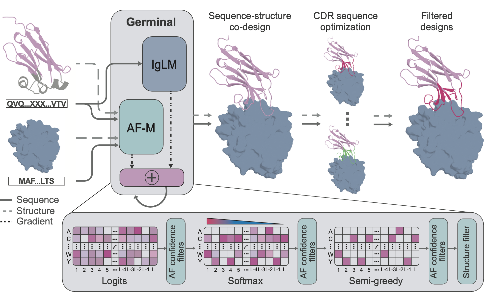

# Germinal: Efficient generation of epitope-targeted de novo antibodies

<p align="center">
  
</p>


Germinal is a pipeline for designing de novo antibodies against specified epitopes on target proteins. The pipeline follows a 3-step process: hallucination based on ColabDesign, selective sequence redesign with AbMPNN, and cofolding with a structure prediction model. Germinal is capable of designing both nanobodies and scFvs against user-specified residues on target proteins. 

We describe Germinal in the preprint: ["Efficient generation of epitope-targeted de novo antibodies with Germinal"](https://www.biorxiv.org/content/10.1101/2025.09.19.677421v1)

**⚠️ We are still actively working on code improvements.**

- We strongly recommend use of [AF3](https://github.com/google-deepmind/alphafold3) for design filtering as done in the paper, as filters are only calibrated for AF3 confidence metrics. We are actively working to add Chai calibrated thresholds for commercial users. Until then, running Germinal with `structure_model: "chai"` and not`structure_model: "af3"` should be considered experimental and may have lower passing rates.
- While nanobody design is fully functional, we are still working on calibrating weightings and filters for scFv, so that functionality should still be also be considered experimental.
- As recommended in the preprint, we suggest performing a small parameter sweep before launching full sampling runs. This is especially important when working with a new target or selecting a new epitope. In `configs/run/vhh_paper.yaml` and `configs/run/scfv_paper.yaml`, we provide the parameters that we used for PD-L1 nanobody generation in our paper. In `configs/run/vhh.yaml` and `configs/run/scfv.yaml` we provide a set of reasonable default parameters to use as a starting point for parameter sweep experiments. Parameters can be configured from the command line, for example, you can set `weights_beta` and `weights_plddt` with the following command:

```bash
python run_germinal.py weights_beta=0.3 weights_plddt: 1.0
```

## Contents

<!-- TOC -->

- [Setup](#setup)
   * [Requirements](#requirements)
   * [Installation](#installation)
   * [Docker](#docker)
- [Usage](#usage)
   * [Quick Start](#quick-start)
      + [Configuration Structure](#configuration-structure)
   * [Basic Usage](#basic-usage)
   * [CLI Overrides](#cli-overrides)
   * [Target Configuration](#target-configuration)
   * [Filters Configuration](#filters-configuration)
- [Output Format](#output-format)
- [Tips for Design](#tips-for-design)
- [Bugfix Changelog](#bugfix-changelog)
- [Citation](#citation)
- [Acknowledgments](#acknowledgments)
- [Community Acknowledgments](#community-acknowledgments)

<!-- TOC -->

<!-- TOC --><a name="setup"></a>
## Setup

<!-- TOC --><a name="requirements"></a>
### Requirements

**Prerequisites:**
- [PyRosetta](https://www.pyrosetta.org/) (academic license required)
- [ColabDesign/AlphaFold-Multimer parameters](https://storage.googleapis.com/alphafold/alphafold_params_2022-12-06.tar) (click link for download or see below for cli)
- [AlphaFold3 parameters](https://github.com/google-deepmind/alphafold3) (optional)
- JAX with GPU support

**System Requirements:**
- **GPU**: NVIDIA GPU with CUDA support
- **Memory**: 40GB+ VRAM*
- **Storage (recommended)**: 50GB+ space for results

> *The pipeline has been tested on: A100 40GB, H100 40GB MIG, L40S 48GB, A100 80GB, and H100 80GB.
> These runs tested a 130 amino acid target with a 131 amino acid nanobody. For larger runs, we recommend 60GB+ VRAM.

<!-- TOC --><a name="installation"></a>
### Installation Tested on RTX5090 | CUDA 13.0 | Kernel 6.19.9 | Ubuntu 25.04

1. Ensure you have an NVIDIA GPU with a recent driver, (CUDA 13.0) and also Miniconda or Anaconda.

Follow the instructions Now:
```
git clone https://github.com/SantiagoMille/germinal.git
cd germinal
```
Create conda environment with Python 3.10
```
conda create --name germinal python=3.10
conda activate germinal
```
Install uv 
```
pip install uv
```	
some more packages
```
uv pip install pandas matplotlib numpy biopython scipy seaborn tqdm ffmpeg py3dmol \
  chex dm-haiku dm-tree joblib ml-collections immutabledict optax cvxopt mdtraj colabfold
```
Download AlphaFold params
```
mkdir -p params
cd params
aria2c -q -x 16 https://storage.googleapis.com/alphafold/alphafold_params_2022-12-06.tar
tar -xf alphafold_params_2022-12-06.tar -C .
cd ..
```
ColabDesign
```
uv pip install -e colabdesign
```
PyRosetta (handle the academic license automatically)
```
uv pip install pyrosetta-installer
```
Install Torch, Chai, and IgLM
```
uv pip install iglm torchvision==0.21.* chai-lab==0.6.1 \
  torch==2.6.* torchaudio==2.6.* torchtyping==0.1.5 torch_geometric==2.6.*
```
Install Project in editable Mode
```
uv pip install -e .
```
Ensure some dependencies compatibility check
```
uv pip install jax==0.5.3
uv pip install dm-haiku==0.0.13 
uv pip install hydra-core omegaconf
uv pip install "jax[cuda12_pip]==0.5.3" -f https://storage.googleapis.com/jax-releases/jax_cuda_releases.html
```
I assume you're in the germinal dir with the env activated
```
cd ~/pathtodirectory/germinal
conda activate germinal
```
Verify GPU jax enabled:
```
python -c "import jax; print('JAX devices:', jax.devices()); print('GPU available:', len(jax.devices('gpu')) > 0)"
```
Check PyRosetta:
```
python -c "import pyrosetta; print('PyRosetta imported successfully')"
```
Verify ColabDesign:
```
python -c "from colabdesign import mk_afdesign_model; print('ColabDesign imported successfully')"
```
Check compatibility torch with 5090 CUDA 13.0:
```
uv pip uninstall torch torchvision torchaudio
uv pip install --pre torch torchvision torchaudio --index-url https://download.pytorch.org/whl/nightly/cu130
```
Finally check every package installed properly:
```
python validate_install.py
```
If the validation passes, try a quick --help output check:
```
python run_germinal.py --help
```
# Before usage
> [!IMPORTANT]
> ### Quick look into - pdl1.yaml settings in /germinal/configs/target/pdl1.yaml

#### Default PDL1 target inputs

```
target_name: "pdl1"                     # Identifier name for this target protein
target_pdb_path: "pdbs/pdl1.pdb"       # Path to the target protein structure file
target_chain: "A"                      # Which chain in the PDB is the target protein
binder_chain: "B"                      # Which chain will be the designed antibody or nanobody
target_hotspots: "A37,A39,A41,A96,A98" # Key hotspots residues for binding
length: 133                            # Number of amino acids in the target protein
```
> [!IMPORTANT]
> ### Quick look into - config.yaml Settings in /germinal/configs/config.yaml
```yaml
# @package *global*
# Main Hydra configuration for Germinal
# This file defines the default configuration and specifies which sub-configs to use
defaults:
  - run: vhh                    # Antibody type: 'vhh' for nanobodies, 'scfv' for full antibodies
  - target: pdl1               # Target protein: which protein to design antibodies against
  - filter/initial: default    # Initial quality filters applied after design generation
  - filter/final: default      # Final acceptance criteria for successful designs
  - *self*                     # Include settings from this file
  - override hydra/hydra_logging: disabled   # Turn off Hydra framework logging
  - override hydra/job_logging: disabled     # Turn off job-specific logging

# High Level Run Settings
project_dir: "."                    # Base directory for the project (current directory)
results_dir: "results"              # Where to save all output files and designs
experiment_name: "germinal_run"     # Name prefix for this design campaign
run_config: ""                      # Additional run identifier (leave empty for default)

# Design Scale and Limits
max_trajectories: 10000             # Maximum design attempts to try
max_hallucinated_trajectories: 1000 # Limit on designs that pass initial generation
max_passing_designs: 100            # Stop when this many designs pass all filters

# File Paths
pdb_dir: "pdbs"                     # Directory containing target protein PDB files
af_params_dir: ""                   # AlphaFold parameters directory (auto-detected if empty)
dssp_path: "params/dssp"            # Path to DSSP secondary structure tool
dalphaball_path: "params/DAlphaBall.gcc"  # Path to DAlphaBall cavity detection tool

# Framework Settings (Advanced)
hydra:
  output_subdir: null               # Don't create extra Hydra output directories
  run:
    dir: .                          # Run from current directory
```

> [!IMPORTANT]
> ### Quick look into - vhh.yaml settings in /germinal/configs/run/vhh.yaml
```yaml
# VHH (Nanobody) Configuration Guide
#General Run Settings
 type: "nb"  #Specifies nanobody design (singlechain antibody fragments from camelids)
 cdr_lengths: [11, 8, 18]  #Length of complementaritydetermining regions (CDR1, CDR2, CDR3) that bind the target
 fw_lengths: [25,17,38,14]  #Framework region lengths that provide structural scaffold
 pregenerate_seeds: false # If true, uses reproducible random seeds; if false, generates random designs
 vh_first/vh_len/vl_len: null  #Not used for nanobodies (only relevant for full antibodies with heavy/light chains)

#Loss Function Parameters (Design Quality Metrics)
These weights control how the germinal optimizes the antibody design:

#Structure Quality Weights
 weights_plddt: 1.0  #Protein confidence score (higher = more confident structure)
 weights_i_plddt: 1.0  #Interface confidence between antibody and target
 weights_pae_intra: 0.1  #Internal structure accuracy within the antibody
 weights_pae_inter: 0.5  #Binding interface accuracy between antibody and target
 weights_iptm: 0.75  #Interface quality metric (critical for binding)

#Contact and Shape Weights
 weights_con_intra/inter: 0.1/0.2  #Rewards proper contacts within antibody and at binding interface
 weights_rg: 0.1  #Radius of gyration (controls antibody compactness)
 weights_helix/beta: 0.1/0.2  #Secondary structure preferences

#Contact Distance Settings
 intra_contact_distance: 14.0  #Distance (Å) to consider internal contacts
 inter_contact_distance: 20.0  #Distance (Å) to consider binding contacts
 intra/inter_contact_number: 2/10  #Target number of contacts
 framework_contact_loss: true  #Penalizes unwanted framework contacts

#Hallucination Settings (Design Process)
 logits_steps: 65  #Initial sequence optimization steps
 softmax_steps: 35  #Sequence refinement steps
 search_steps: 10  #Final sequence search steps
 search_mutation_rate: 0.05  #Probability of mutations during search

#Quality Thresholds
 plddt_threshold: 0.82  #Minimum structure confidence (01 scale)
 i_ptm_threshold: 0.68  #Minimum interface quality
 i_pae_threshold: 0.27  #Maximum interface error (lower is better)
 seq_entropy_threshold: 0.10  #Sequence diversity control

#IgLM Settings (Language Model for Antibodies)
 grad_merge_method: "pcgrad"  #Method for combining gradients from different loss terms
 iglm_scale: [0.2, 0.4, 0.4, 1.0]  #Relative importance of language model for each CDR and framework
 iglm_temp: 0.6  #Temperature for sequence sampling (lower = more conservative)
 iglm_species: "[HUMAN]"  #Species context for the language model
 seq_init_mode: ["gumbel", "soft"]  #Sequence initialization methods
 bias_redesign: 10  #Bias strength for sequence redesign
 use_pos_distance: true  #Use positional distance information
 clear_best: true  #Clear best design between iterations

#Sequence Redesign Settings (AbMPNN)
 mpnn_fix_interface: true  #Keep binding interface residues fixed during redesign
 num_seqs: 40  #Number of sequences to generate
 max_mpnn_sequences: 4  #Maximum sequences to carry forward
 sampling_temp: 0.1  #Temperature for MPNN sampling
 backbone_noise: 0.0  #Structural noise added to backbone
 model_path/mpnn_weights: "abmpnn"  #AbMPNN model for antibodyspecific redesign

#Structure Prediction Settings
 structure_model: "chai"  #AI model for structure prediction (chai/af3/af2)
 msa_mode: "target"  #Multiple sequence alignment mode

#AlphaFold3 Configuration (when using AF3)
 af3_model_dir: null  #Path to AF3 model parameters
 af3_repo_path/sif_path: null  #AF3 installation paths
 msa_db_dir: null  #Multiple sequence alignment database
 use_metagenomic_db: false  #Use metagenomic sequences for MSA

#Template Removal Settings
Controls what structural information to remove from templates:
 rm_template_seq: true  #Remove template sequence information
 rm_template_sc: false  #Keep template side chains
 rm_binder_seq/sc: true  #Remove binder sequence and side chains
 rm_binder: false  #Don't remove entire binder structure

#Advanced Settings (Usually Don't Change)

#Optimization Parameters
 learning_rate: 0.1  #Step size for gradient descent
 optimizer: "sgd"  #Optimization algorithm
 normalize_gradient: true  #Normalize gradient magnitudes
 num_recycles_design: 3  #Structure prediction recycles
 recycle_mode: "last"  #Which recycle to use

#Additional Loss Terms
 use_helix/beta_loss: true  #Encourage secondary structure
 beta_loss_type: "strand"  #Type of beta structure loss
 use_rg_loss: true  #Use radius of gyration loss
 use_i_ptm_loss: true  #Use interface PTM loss

#Output Settings
 save_design_animations: false  #Save design trajectory animations
 save_design_trajectory_plots: true  #Save optimization plots
 omit_AAs: "C"  #Amino acids to avoid (C=cysteine, prevents unwanted disulfides)

#Filter Thresholds
These control which designs pass quality checks:
 clash_threshold: 2.4  #Maximum atomic clash distance (Å)
 hotspot_distance_threshold: 5.3  #Distance to target hotspots (Å)
 residue_contact_distance: 6.0  #Residue contact threshold (Å)
 min_cdr_hotspot_contacts: 3  #Minimum CDR contacts with hotspots
 sap_limit_sasa: 3.0  #Surface accessibility threshold
 sap_patch_radius: 7.5  #Surface patch radius (Å)
 atom_distance_cutoff: 3.0  #Atom distance for redesign (Å)
```

> [!IMPORTANT]
> ### Quick look into - scfv.yaml settings in /germinal/configs/run/scfv.yaml

```yaml
# @package _global_
# scFv run configuration
# This file configures a run for designing a single-chain variable fragment (scFv).

---
# General run settings
# These parameters define the basic architecture of the scFv molecule.
type: "scfv"                               # The type of molecule being designed.
cdr_lengths: [8, 8, 13, 6, 6, 9]           # Lengths of the 6 CDRs (H1, H2, H3, then L1, L2, L3).
fw_lengths: [25,17,38,52,17,33,10]         # Lengths of the 7 framework regions that form the scaffold.
pregenerate_seeds: false                   # If true, creates initial random sequences before the main process.
vh_first: true                             # If true, the heavy chain (VH) comes before the light chain (VL) in the sequence.
vh_len: 120                                # Total length of the heavy chain variable domain.
vl_len: 108                                # Total length of the light chain variable domain.

---
# Loss function parameters
# These weights control the importance of different quality metrics during optimization. The goal is to minimize a total "loss" score.
weights_plddt: 1.0                         # Importance of the overall structure's confidence score (pLDDT).
weights_i_plddt: 1.0                       # Importance of the pLDDT score specifically at the binding interface.
weights_pae_intra: 0.1                     # Importance of correctly predicting relative positions *within* a single chain (PAE).
weights_pae_inter: 0.5                     # Importance of correctly predicting relative positions *between* the two chains.
weights_iptm: 0.75                         # Importance of the interface prediction confidence score (ipTM).
weights_con_intra: 0.1                     # Importance of forming correct contacts *within* each chain.
weights_con_inter: 0.2                     # Importance of forming correct contacts *between* the two chains.
weights_rg: 0.1                            # Importance of the radius of gyration (protein compactness).
weights_helix: 0.1                         # Importance of forming alpha-helices.
weights_beta: 0.1                          # Importance of forming beta-sheets.

intra_contact_distance: 14.0               # Maximum distance (in Angstroms, Å) for an intra-chain contact.
inter_contact_distance: 20.0               # Maximum distance (Å) for an inter-chain contact.
intra_contact_number: 2                    # Target number of intra-chain contacts to encourage.
inter_contact_number: 10                   # Target number of inter-chain contacts to encourage.
framework_contact_loss: true               # If true, includes framework region contacts in the loss calculation.
framework_contact_offset: 1                  # An offset value used in the framework contact calculation.

---
# Hallucination settings
# "Hallucination" refers to generating a novel protein sequence from scratch. These settings control that process.
logits_steps: 60                           # Number of optimization steps applied to the raw model outputs (logits).
softmax_steps: 35                          # Number of optimization steps applied after the softmax function (probabilities).
search_steps: 10                           # Number of steps for a random mutation-based search to refine the sequence.
search_mutation_rate: 0.05                 # Probability of mutating an amino acid during the search phase.
plddt_threshold: 0.8                       # Minimum pLDDT score for a design to be considered successful.
i_ptm_threshold: 0.68                      # Minimum interface pTM score for a design to be considered successful.
i_pae_threshold: 0.27                      # Maximum interface PAE score for a design to be considered successful.
seq_entropy_threshold: 0.10                # A threshold for sequence diversity to prevent the model from getting stuck.

---
# IgLM settings
# Controls the use of an Immunoglobulin Language Model (IgLM) to generate more "natural" antibody-like sequences.
grad_merge_method: "pcgrad"                # Method for combining model updates to prevent conflicting signals.
iglm_scale: [0.0, 0.2, 0.4, 1.0]           # A schedule that controls how strongly the IgLM influences the design over time.
iglm_temp: 0.6                             # "Temperature" for sampling. Higher values lead to more diverse sequences.
iglm_species: "[HUMAN]"                    # Biases the generated sequence to resemble antibodies from a specific species.
seq_init_mode: ["gumbel", "soft"]          # Method used to generate the very first sequence.
bias_redesign: 10                          # The strength of the bias applied during the sequence redesign phase.
use_pos_distance: true                     # If true, incorporates positional distance information into the model.
clear_best: true                           # If true, clears the memory of the "best design so far" at certain intervals.

---
# Sequence redesign settings
# Controls the process of refining the amino acid sequence for a given 3D backbone, often using a tool like MPNN.
mpnn_fix_interface: true                   # If true, the amino acids at the binding interface are kept unchanged during redesign.
num_seqs: 40                               # The total number of new sequences to generate for the final design.
max_mpnn_sequences: 4                      # The maximum number of sequences the MPNN model should propose for each backbone.
sampling_temp: 0.1                         # Sampling temperature for MPNN. Lower is more conservative; higher is more diverse.
backbone_noise: 0.0                        # Amount of random noise to add to backbone coordinates before redesign.
model_path: "abmpnn"                       # Specifies the file path for the sequence redesign model.
mpnn_weights: "abmpnn"                     # Specifies which pre-trained weights to use for the MPNN model.

---
# Structure prediction settings
structure_model: "chai"                    # The name of the software to use for predicting the 3D structure (e.g., "chai", "af3").
msa_mode: "target"                         # The method for generating the Multiple Sequence Alignment (MSA).

---
# AF3 configuration (required when structure_model == "af3")
af3_repo_path: null                        # Path to the AlphaFold 3 repository (user must provide).
af3_sif_path: null                         # Path to the AlphaFold 3 singularity image file (user must provide).
af3_model_dir: null                        # Path to the AlphaFold 3 model parameters directory (user must provide).
af3_db_dir: null                           # Path to the AlphaFold 3 sequence databases (user must provide).
msa_db_dir: null                           # Path to the MSA databases (user must provide).
use_metagenomic_db: false                  # If true, searches massive environmental sequence databases.

---
# Template removal settings
# Controls how the algorithm uses (or ignores) known protein structures (templates).
rm_template_seq: true                      # If true, removes the amino acid sequence from a template, using only its backbone shape.
rm_template_sc: false                      # If true, removes the side-chain information from a template.
rm_binder: false                           # If true, completely removes the binding partner from a template complex.
rm_binder_seq: true                        # If true, removes only the sequence of the binding partner.
rm_binder_sc: true                         # If true, removes only the side-chain information of the binding partner.

---
###### REMAINING SETTINGS ######
# These settings are typically not changed from run to run.

# Model and Optimization settings
learning_rate: 0.1                         # The learning rate for the optimizer.
optimizer: "sgd"                           # The type of optimizer to use (e.g., "sgd", "adam").
normalize_gradient: true                   # If true, normalizes the gradients during optimization.
linear_lr_annealing: false                 # If true, linearly decreases the learning rate over time.
min_lr_scale: 0.01                         # The minimum learning rate scale when annealing.
use_multimer_design: true                  # Set to true for multi-chain designs like scFv.
sample_models: true                        # If true, samples from different structure prediction models.
num_models: 1                              # Number of models to use for structure prediction.
num_recycles_design: 3                     # How many times the model refines its own prediction.
recycle_mode: "last"                       # Which iteration's output to use for the next recycle.
soft_iterations: 60                        # Number of iterations for the soft sequence optimization phase.

# Other loss settings
use_helix_loss: true                       # If true, enables the alpha-helix loss term.
use_beta_loss: true                        # If true, enables the beta-sheet loss term.
beta_loss_type: "strand"                   # The type of calculation for beta-sheet loss.
use_rg_loss: true                          # If true, enables the radius of gyration loss term.
use_termini_distance_loss: false           # If true, adds a loss term for the distance between chain ends.
use_i_ptm_loss: true                       # If true, enables the interface pTM loss term.

# File management settings
save_design_animations: false              # If true, saves the design process as an animation (e.g., GIF).
save_design_trajectory_plots: true         # If true, saves plots tracking metrics over the design trajectory.

# Other settings
omit_AAs: false                            # If true, prevents the use of certain specified amino acids.
force_reject_AA: false                     # If true, forces rejection of certain amino acids.
dgram_cce: 0.01                            # A parameter for the distogram loss calculation.
show_config: true                          # If true, prints the configuration at the start of the run.

# Filter thresholds (used for post-processing and filtering final designs)
clash_threshold: 2.4                       # Å for atomic clash detection.
hotspot_distance_threshold: 5.3            # Å to consider residues near binding hotspots.
residue_contact_distance: 6.0              # Å threshold for residue-residue contact.
min_cdr_hotspot_contacts: 3                # Minimum hotspot contacts required in CDRs.
sap_limit_sasa: 3.0                        # Minimal Solvent Accessible Surface Area (SASA) in a patch to be considered.
sap_patch_radius: 7.5                      # Å radius for Surface Aggregation Propensity (SAP) patch calculation.
sap_avg_sasa_patch_thr: 1.5                # Average SASA threshold per patch for SAP analysis.
atom_distance_cutoff: 3.0                  # Å threshold for atom distance in redesign.
```

#### Outputs
- **Results Structure**:
  - `accepted/` - Designs ready for experimental testing
  - `trajectories/` - Designs that failed filters
  - `redesign_candidates/` - Designs that were redesigned but still failed

<!-- TOC --><a name="usage"></a>
## Usage

<!-- TOC --><a name="quick-start"></a>
### Quick Start

The main entry point to the pipeline is `run_germinal.py`. Germinal uses [Hydra](https://hydra.cc/) for orchestrating different configurations. An example main configuration file is located in `configs/config.yaml`. This yaml file contains high level run parameters as well as pointers to more granular configuration settings.

These detailed options are stored in four main settings files:

 - **Main run settings**: `configs/run/vhh.yaml`
 - **Target settings**: `configs/target/[your_target].yaml`
 - **Post-hallucination (initial) filters**: `configs/filter/initial/default.yaml`
 - **Final filters**: `configs/filters/final/default.yaml`

<!-- TOC --><a name="configuration-structure"></a>
#### Configuration Structure

```
configs/
├── config.yaml              # Main configuration yaml
├── run/                     # Main run settings
│   ├── vhh.yaml             # VHH (nanobody) specific settings
│   └── scfv.yaml            # scFv specific settings
├── target/                  # Target protein configurations
│   └── pdl1.yaml            # PDL1 target example
└── filter/                  # Filter configurations
    ├── initial/
    │   └── default.yaml     # Post-hallucination (initial) filters
    └── final/
        ├── default.yaml     # Final acceptance filters
        └── scfv.yaml        # Final filters for scfv runs
```


> [!IMPORTANT]
> # In general, the main run settings and filters should stay the same and can be run as defaults unless you are experimenting. To design nanobodies targeting PD-L1, simply run:

```bash
python run_germinal.py
```

To design scFvs targeting PD-L1, run:

```bash
python run_germinal.py run=scfv filter.initial=scfv
```

If you wish to change the configuration of runs, you can:

 - create an entirely new config yaml
 - swap one of the four main settings files
 - pass specific overrides

<!-- TOC --><a name="basic-usage"></a>
### Basic Usage

**Run with defaults (VHH + PDL1 + default filters):**
```bash
python run_germinal.py
```

**Switch to scFv:**
```bash
python run_germinal.py run=scfv
```

**Use different target:**
```bash
python run_germinal.py target=my_target
```

**Use a different config file with Hydra:**
```bash
python run_germinal.py --config_name new_config.yaml
```

<!-- TOC --><a name="cli-overrides"></a>
### CLI Overrides

Hydra provides powerful CLI override capabilities. You can override any parameter in any configuration file.

> [!NOTE]
> Settings in `configs/run/` folder use the global namespace and do not need a `run` prefix before overriding. See example below.

**Basic parameter overrides:**
```bash
# Override trajectory limits
python run_germinal.py max_trajectories=100 max_passing_designs=50

# Override experiment settings
python run_germinal.py experiment_name=my_experiment run_config=test_run

# Override loss weights. Note: no run prefix since run settings are global
python run_germinal.py weights_plddt=1.5 weights_iptm=0.8 
```

**Filter threshold overrides:**
```bash
# Make initial filters less stringent
python run_germinal.py filter.initial.clashes.value=2

# Adjust final filter thresholds
python run_germinal.py filter.final.external_plddt.value=0.9 filter.final.external_iptm.value=0.8

# Change filter operators
python run_germinal.py filter.final.sc_rmsd.operator='<=' filter.final.sc_rmsd.value=5.0
```

**Target configuration overrides:**
```bash
# Change target hotspots
python run_germinal.py target.target_hotspots="A26,A30,A36,A44"

# Use different PDB file
python run_germinal.py target.target_pdb_path="pdbs/my_target.pdb" target.target_name="my_target"
```

**Complex multi-parameter overrides:**
```bash
# Complete scFv run with custom settings
python run_germinal.py \
  run=scfv \
  target=pdl1 \
  max_trajectories=500 \
  experiment_name="scfv_pdl1_test" \
  target.target_hotspots="A37,A39,A41" \
  filter.final.external_plddt.value=0.85 \
  weights_iptm=1.0
```


<!-- TOC --><a name="target-configuration"></a>
### Target Configuration

For each new target, you will need to define a target settings yaml file which contains all relevant information about the target protin. Here is an example:

```yaml
target_name: "pdl1"
target_pdb_path: "pdbs/pdl1.pdb"
target_chain: "A"
binder_chain: "B"
target_hotspots: "25,26,39,41"
dimer: false  # support coming soon!
length: 133
```

<!-- TOC --><a name="filters-configuration"></a>
### Filters Configuration

There are two sets of filters: post-hallucination (initial) filters and final filters. The post-hallucination filters are applied after the hallucination step to determine which sequences to proceed to the redesign step. This filter set is a subset of the final filters, which is applied at the end of the pipeline to determine passing antibody sequences. Here is an example of the post-hallucination filters:
```yaml
clashes: {'value': 1, 'operator': '<'}
cdr3_hotspot_contacts: {'value': 0, 'operator': '>'}
percent_interface_cdr: {'value': 0.5, 'operator': '>'}
interface_shape_comp: {'value': 0.6, 'operator': '>'}
```

<!-- TOC --><a name="output-format"></a>
## Output Format

Germinal generates organized output directories:

```
runs/your_target_nb_20240101_120000/
├── final_config.yaml           # Complete run configuration after overrides
├── trajectories/               # Results for trajectories which pass hallucination but fail the first set of filters
│   ├── structures/     
│   ├── plots/            
│   └── designs.csv      
├── redesign_candidates/        # Results for trajectories which are AbMPNN redesigned but fail the final set of filters
│   ├── structures/          
│   └── designs.csv           
├── accepted/                   # Antibodies that pass all filters
│   ├── structures/          
│   └── designs.csv           
├── all_trajectories.csv        # Main CSV containing designs in all three folders above
└── failure_counts.csv          # CSV logging # trajectories failing each step of hallucination
```

**Key Output Files:**
- `accepted/structures/*.pdb` - Final antibody-antigen structure for passing antibody designs.
- `all_trajectories.csv` - Complete list of designs that passed hallucination, their *in silico* metrics, which stage they reached, and the pdb path to the designed structure.

<!-- TOC --><a name="tips-for-design"></a>
## Important Notes and Tips for Design

Hallucination is inherently expensive. Designing against a 130 residue target takes anywhere from 2-8 minutes for a nanobody design iteration on an H100 80GB GPU, depending on which stage the designed sequence reaches. For 40GB GPUs or scFvs, this number is around 50% larger.

During sampling, we typically run antibody generation until there are around 1,000 passing designs against the specified target and observe a success rate of around 0.5 - 1 per GPU hour. Of those, we typically select the top 40-50 sequences for experimental testing based on a combination of *in silico* metrics described in the preprint. While *in silico* success rates vary wildly across targets, we estimate that 200-400 H100 80GB GPU hours of sampling are typically enough to generate ~200 successful designs and some functional antibodies. 

Best design parameters are different for each target and antibody type! If you are experiencing low success rates, we recommend tweaking interface confidence weights (ipTM / iPAE), structure-based weights (helix, beta, framework loss), or the IgLM weights defined in `iglm_scale`. Filters are easily changeable in the filters configurations. To add or remove filters from the initial and final filtering rounds, simply create a new filter with the same name as the intended metric and specify the threshold value and the operator (<, >, =, etc).

More tips coming soon!

<!-- TOC --><a name="bugfix-changelog"></a>
## Bugfix Changelog

- 9/25/25: Import fix for local colabdesign module ([commit 8b5b655](https://github.com/SantiagoMille/germinal/commit/8b5b655), [pr #8](https://github.com/SantiagoMille/germinal/pull/8)) 
- 9/25/25: A metric meant for tracking purposes `external_i_pae` was erroneously set to be used as a filter ([commit 49be2e9](https://github.com/SantiagoMille/germinal/commit/49be2e9), [issue #7](https://github.com/SantiagoMille/germinal/issues/7))
- 9/26/25: Resolved an error which caused passing runs to crash at the final stage due to a misnamed variable ([commit 9292e1e](https://github.com/SantiagoMille/germinal/commit/9292e1e), [issue #11](https://github.com/SantiagoMille/germinal/issues/11))

<!-- TOC --><a name="citation"></a>
## Citation

If you use Germinal in your research, please cite:

```bibtex
@article{mille-fragoso_efficient_2025,
	title = {Efficient generation of epitope-targeted de novo antibodies with Germinal},
   author = {Mille-Fragoso, Luis Santiago and Wang, John N. and Driscoll, Claudia L. and Dai, Haoyu and Widatalla, Talal M. and Zhang, Xiaowe and Hie, Brian L. and Gao, Xiaojing J.},
	url = {https://www.biorxiv.org/content/10.1101/2025.09.19.677421v1},
	doi = {10.1101/2025.09.19.677421},
	publisher = {bioRxiv},
	year = {2025},
}
```

<!-- TOC --><a name="acknowledgments"></a>
## Acknowledgments

Germinal builds upon the foundational work of previous hallucination-based protein design pipelines such as ColabDesign and BindCraft and this codebase incorporates code from both repositories. We are grateful to the developers of these tools for making them available to the research community. 

**Related Work:**
If you use components of this pipeline, please also cite the underlying methods:

- **ColabDesign**: [https://github.com/sokrypton/ColabDesign](https://github.com/sokrypton/ColabDesign)
- **IgLM**: [https://github.com/Graylab/IgLM](https://github.com/Graylab/IgLM)
- **Chai-1**: [https://github.com/chaidiscovery/chai-lab](https://github.com/chaidiscovery/chai-lab)
- **AlphaFold3**: [https://github.com/google-deepmind/alphafold3](https://github.com/google-deepmind/alphafold3)
- **AbMPNN**: [Dreyer, F. A., Cutting, D., Schneider, C., Kenlay, H. & Deane, C. M. Inverse folding for
antibody sequence design using deep learning. (2023).](https://www.biorxiv.org/content/10.1101/2025.05.09.653228v1.full.pdf)
- **PyRosetta**: [https://www.pyrosetta.org/](https://www.pyrosetta.org/)

<!-- TOC --><a name="community-acknowledgments"></a>
## Community Acknowledgments

- [@cytokineking](https://github.com/cytokineking) — for helping raise numerous bugs to our attention

## License

This repository is licensed under the [Apache License 2.0](LICENSE).

### External Dependencies

Some components require separate licenses that are not included in this repository:

- **IgLM**: Provided under a non-commercial academic license from Johns Hopkins University.  
  See their documentation for details.  
- **PyRosetta**: Provided by the Rosetta Commons and University of Washington under a non-commercial, non-profit license.  
  PyRosetta cannot be redistributed and must be obtained separately.  
  Commercial use requires a separate license. See [https://www.pyrosetta.org](https://www.pyrosetta.org).
